# Полное описание функционала обновления 1.0.6 (Xneon Launcher)

Данный документ содержит исчерпывающее техническое и пользовательское описание абсолютно всего функционала, добавленного в **Xneon Launcher** после версии **1.0.5** (включая все коммиты в Git и текущую кодовую базу). 

Все перечисленные ниже разделы, экраны, кнопки, диалоги и механизмы являются новыми возможностями версии **1.0.6**.

---

## Сводка изменений относительно 1.0.5

Ниже — что именно появилось, изменилось, починено и выпилено по сравнению с **1.0.5**. Подробное описание каждого раздела — в частях 1–9 дальше по документу.

### Скриншоты

Все снимки сделаны в стандартной теме лаунчера («Core»), окно 1280×800.

**Главная** — аккаунт, выбор версии и сборки, быстрый запуск, новости

**Сборки** — список, категории, корзина, переходы в каталоги Modrinth / CurseForge / FTB

**Сборка: Информация** — иконка, версия, загрузчик, статистика игры
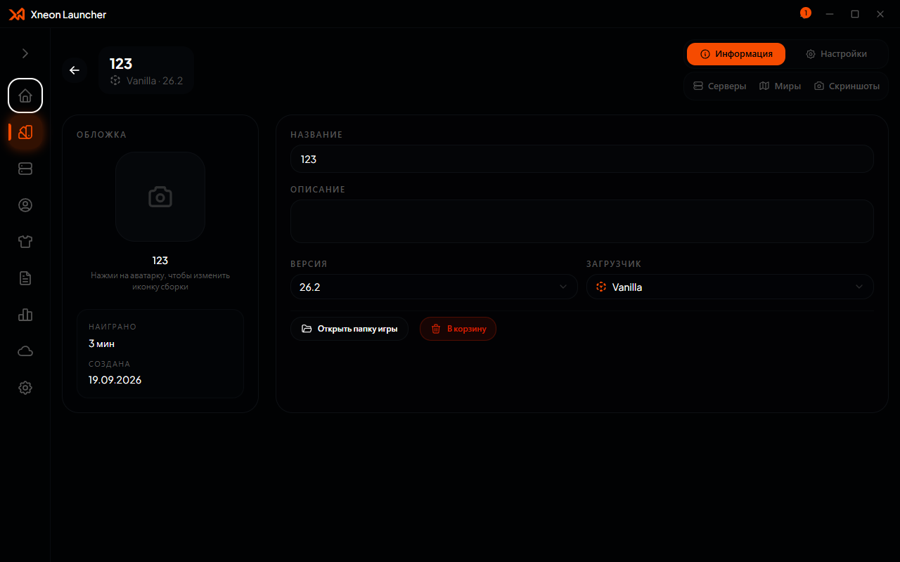

**Сборка: Настройки** — Java и память, размер окна, команды запуска, wrapper, переменные окружения, автоподключение к серверу
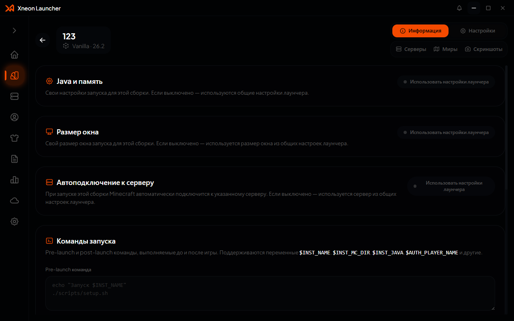

**Экспорт сборки** — выбор содержимого архива по категориям
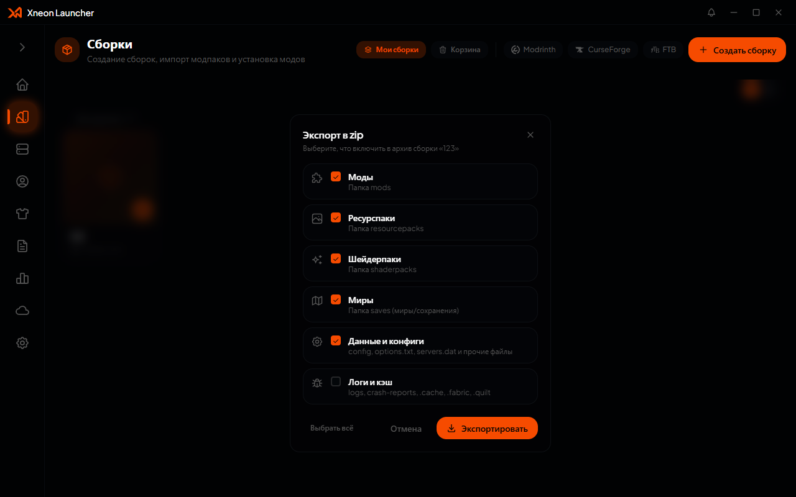

**Серверы** — список серверов, статусы, категории, корзина, каталоги сборок
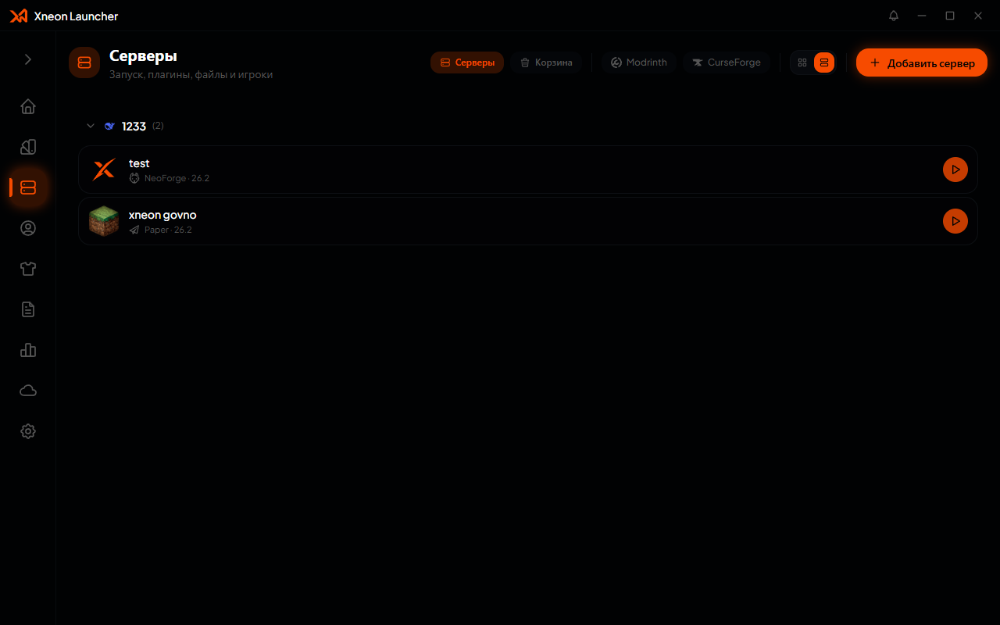

**Сервер: Консоль** — вывод сервера и отправка команд
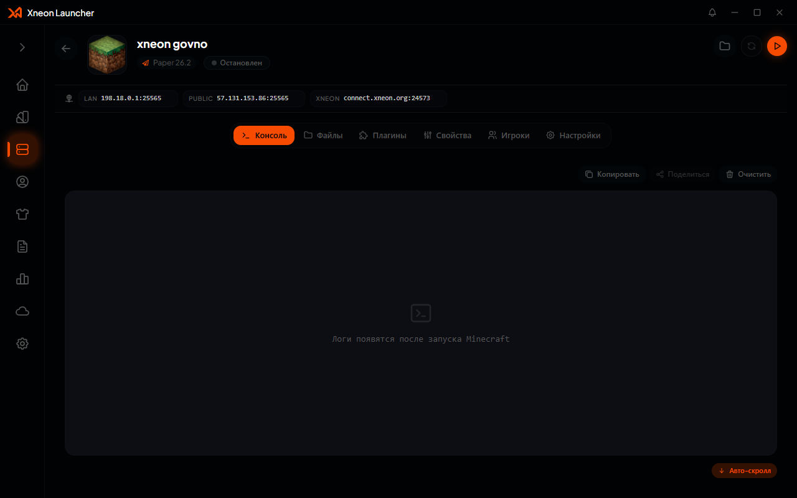

**Сервер: Плагины и моды** — поиск и установка из Modrinth и CurseForge
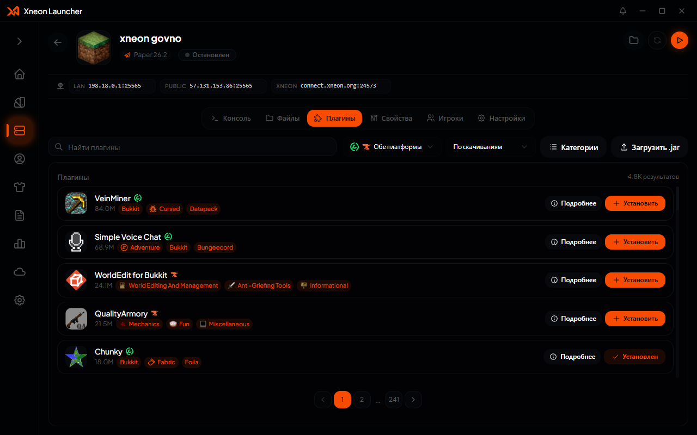

**Сервер: Свойства** — редактирование `server.properties` с пояснениями
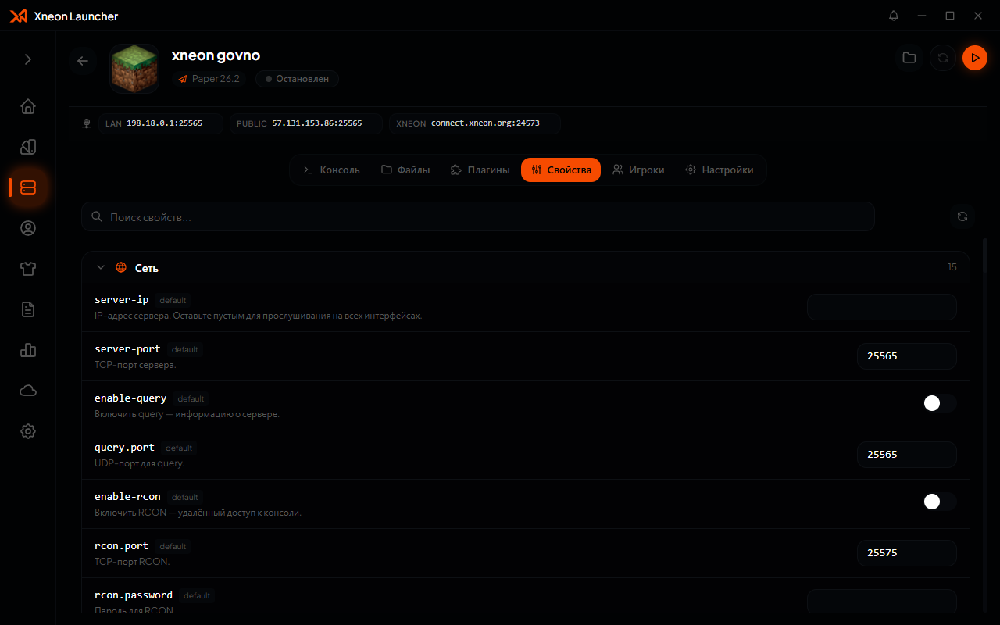

**Сервер: Игроки** — whitelist, операторы, баны, баны по IP
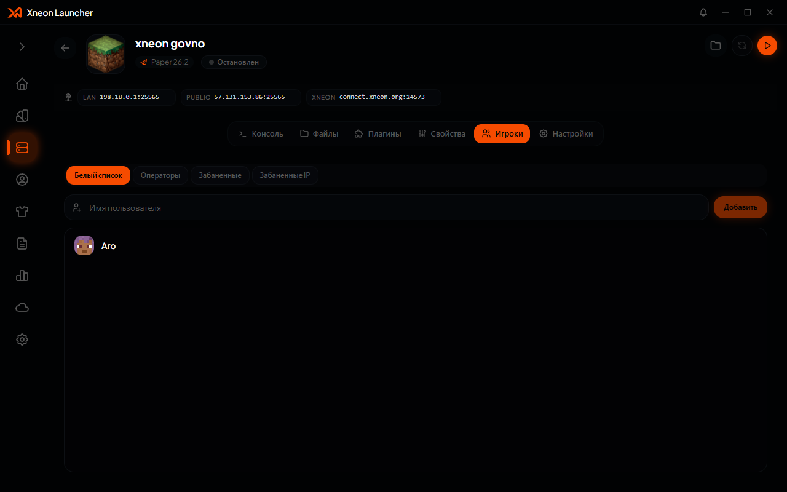

**Сервер: Настройки** — имя, Java и память, аргументы JVM, XN Connect
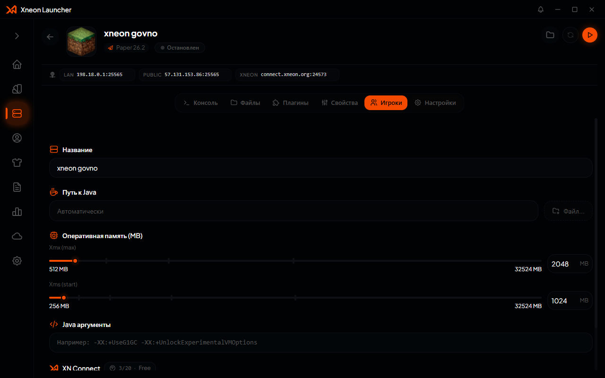

**Облако** — подключение хранилища и работа с файлами сборок и серверов
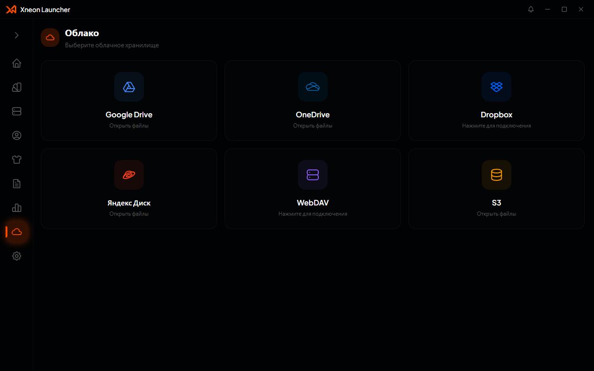

**Статистика** — время в игре, аптайм серверов, активность, топы

**Логи запуска** — события лаунчера и игры, фильтры по уровню, поиск, AI-разбор краша
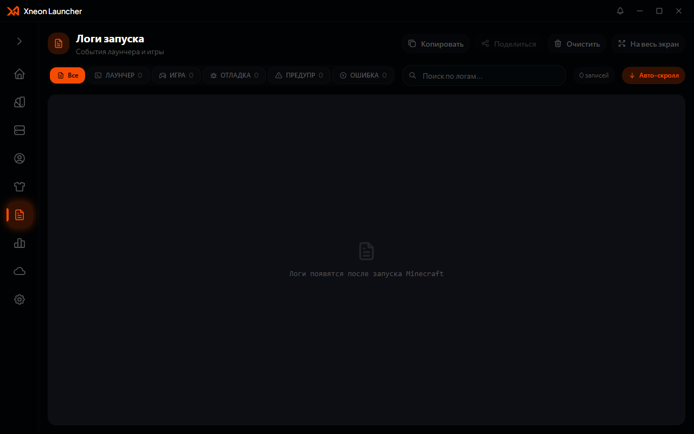

**Аккаунты** — Microsoft, Ely.by, XN Skins и оффлайн-аккаунты
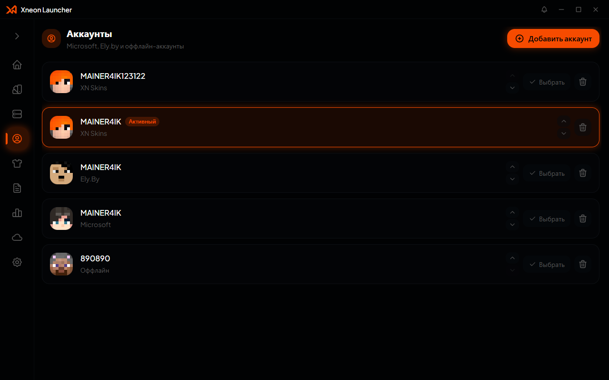

**Скины** — с активным аккаунтом Microsoft: превью персонажа, библиотека и смена скина
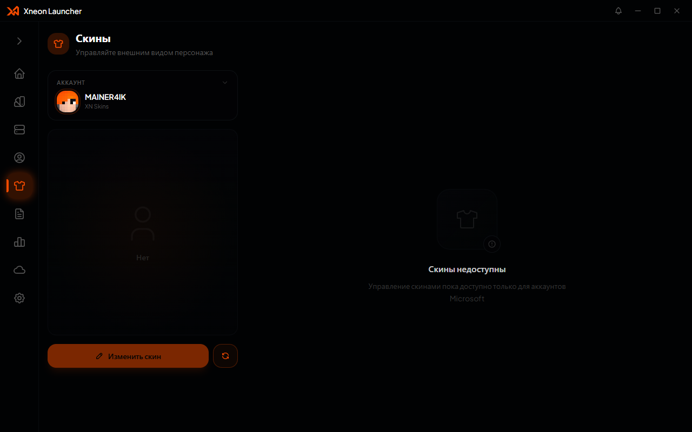

**Настройки: Игра** — разрешение, память, автоподключение
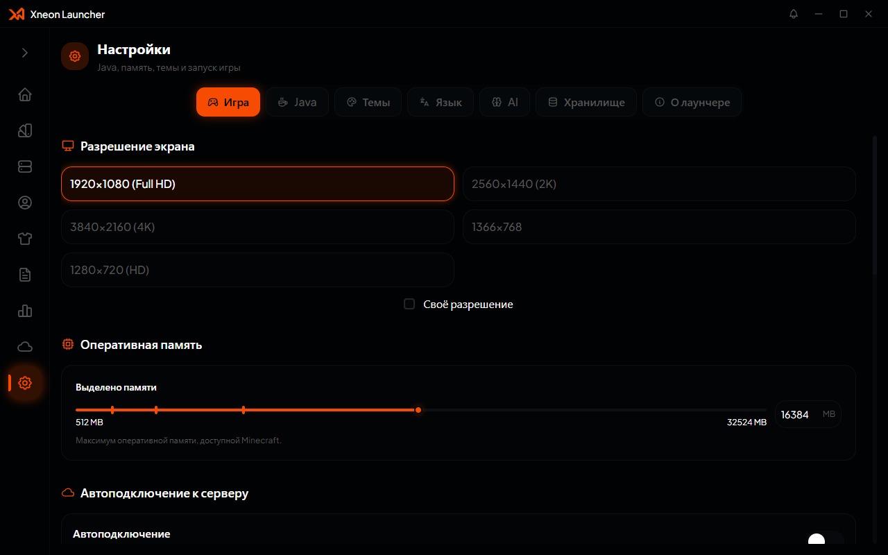

**Настройки: Темы** — готовые темы и своя
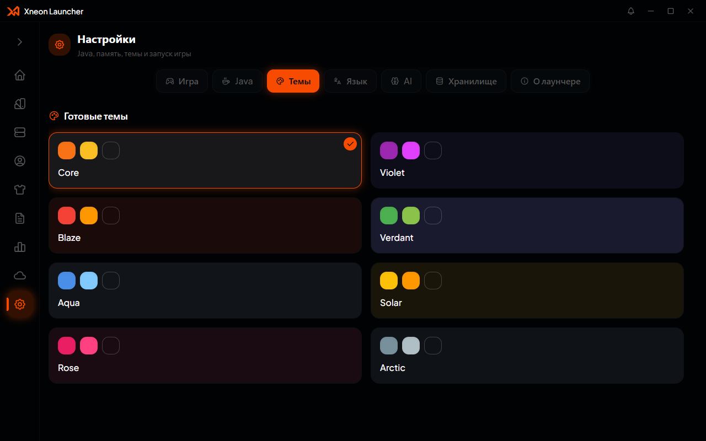

**Настройки: Хранилище** — занятое место по категориям и очистка

### Добавлено

**Раздел «Серверы» (полноценный менеджер серверов)**
- Новый раздел в боковом меню: создание, запуск, мониторинг и администрирование локальных серверов.
- Пошаговый мастер создания сервера: имя и иконка, версия Minecraft, ядро (vanilla / paper / purpur / folia / fabric / quilt / forge / neoforge / spigot / bukkit / bungeecord / velocity / waterfall / sponge-*), выбор билда, память, порт, online-mode, max-players, Java (авто или своя), свой JAR с автоопределением версии и лоадера.
- Вкладки сервера: консоль с отправкой команд, файлы, плагины/моды (Modrinth + CurseForge), свойства (`server.properties`), игроки (whitelist/ops/баны), настройки, метрики в шапке (CPU/RAM/аптайм).
- Автоматическая установка Java-рантайма под версию сервера, скачивание и проверка JAR, установка модпаков сервера.
- Действия: дублирование, экспорт в ZIP (с выбором категорий), контекстное меню, корзина с восстановлением, группы серверов.
- Локальный пакет `@xnlc/servers` (менеджер процессов, статус, метрики, детект готовности по консоли).

**XN Connect вместо устаревшего P2P**
- Облачные туннели для доступа к серверу извне, счётчик использования и лимиты по подписке, автоподъём/гашение туннеля вместе с сервером.

**Быстрая игра (Quick Play)**
- Карточка на главной: список серверов из `servers.dat` сборки с пингом, статусом, MOTD, онлайном и иконкой, плюс список миров.
- Запуск игры сразу с подключением к выбранному серверу (`--quickPlayMultiplayer`) или миру (`--quickPlaySingleplayer`), общий `--quickPlayPath`.
- Автоподключение к серверу из настроек сборки и из настроек лаунчера.

**Экспорт и импорт сборок**
- Экспорт сборки в ZIP с выбором содержимого (моды, ресурспаки, шейдеры, миры, конфиги, логи) и **манифестом `xnlauncher.json`** внутри архива.
- Импорт собственного формата: «Создать сборку → Импортировать → Сборка Xneon (.zip)» — версия, загрузчик и иконка берутся из манифеста.
- Экспорт списка модов в HTML / Markdown / JSON / CSV / TXT (из БД, без повторного сканирования).

**Остальные разделы и функции**
- «Статистика»: сессии, время в игре, аптайм серверов, диапазоны дат, графики активности, топы сборок и серверов.
- «Хранилище»: анализ занятого места по категориям, очистка логов/кэша/крешей, корзина сборок.
- Обновления контента сборок: фоновый чекер, диалог обновлений, группировка и обновление пачкой.
- Облако: выборочная загрузка и импорт, работа с серверами, метаданные архивов.
- AI-ассистент: стриминг ответов, анализ краш-логов, сессии, шифрование конфигурации.
- Локальный пакет `@xnlc/nbt` вместо `prismarine-nbt` (`servers.dat` — сырой NBT, `level.dat` — gzip).
- UI-компоненты: единый `EmptyState`, общий слой модалок `ModalLayer`, встроенные логотипы сборок (`builtin-logos`), пикер иконок, категории сборок и серверов с drag&drop, пагинация, тосты корзины.
- Локализация: все строки через `react-i18next`, 5 языков (ru / en / de / es / uk).

### Изменено

- **Запуск игры.** Pre-launch и post-launch команды теперь выполняются через шелл (перенаправления, пайпы, кавычки в путях), переменные окружения доезжают и до команд, и до игры; wrapper-команда при длинной командной строке уходит в `@argfile` (как в Forge/NeoForge) — см. «Исправлено».
- **Экспорт сборки** собирается асинхронно, с индикатором прогресса, вместо блокировки интерфейса.
- **Модалки** ведут себя единообразно: закрываются кликом по фону, по Esc и крестиком; клик внутри панели не закрывает.
- **Серверы**: повторный `stop` не дублирует команду, остановка стартующего сервера отменяет запуск, старт идемпотентен.
- **Идентичность контента**: ключи и сравнения переведены на пару `(источник, projectId)` — одинаковые slug на разных платформах больше не считаются одним проектом.
- **База данных**: пустая запись от рендерера больше не может затереть список сборок целиком.
- Страницы получили описательные подзаголовки вместо счётчиков, логотипы и иконки загрузчиков окрашиваются цветом темы.

### Исправлено

**Серверы**
- Остановка запускающегося сервера больше не приводит к ошибке `Command exception: /stop` (NullPointerException в Paper): команда `stop` не отправляется до подтверждения готовности, процесс гасится напрямую.
- Повторные нажатия «Остановить» больше не выполняют команду несколько раз и не рассылают пачку событий состояния.
- Остановка стартующего сервера занимает доли секунды вместо ожидания 30 секунд.
- «Запустил и сразу остановил» больше не оставляет работающий сервер при интерфейсе «Остановлен».
- В консоли вместо `exit code null` пишется понятное «процесс остановлен лаунчером (signal SIGKILL)», ложное «сервер упал при запуске» на собственную остановку не выводится.
- Команды, отправленные из консоли до готовности сервера, больше не теряются и не падают — вместо этого выводится пояснение.

**Запуск игры**
- Pre-launch и post-launch команды, которые писали файлы с кавычками в путях, молча не срабатывали (cmd получал токены по отдельности и падал на синтаксисе, а код считал это успехом) — теперь работают.
- Wrapper-команда (`.cmd`/`.bat`) ломала запуск на модовых сборках: вся команда java шла через `cmd.exe`, у которого лимит ~8191 символа — «Слишком длинная командная строка» / «Слишком длинная входная строка». Теперь аргументы java кладутся в `@argfile`, временный файл удаляется после выхода игры.

**Экспорт и импорт**
- Экспорт сборки больше не морозит лаунчер: синхронная упаковка (до 26 секунд на реальной сборке) заменена на асинхронную с прогрессом.
- Наш собственный экспорт теперь импортируется (раньше — «Неизвестный формат модпака»).
- При импорте файла лаунчер больше не затемняет экран и не показывает мелкую модалку до выбора архива; диалог создания закрывается сразу после выбора файла.

**Интерфейс**
- Модалки приведены к единому поведению (в «Аккаунтах» закрывались только крестиком).
- Иконки категорий в экспорте сборки, экспорте сервера, облаке и «Хранилище» приведены к тем же, что во вкладках (моды — пазл, ресурспаки — фото, шейдеры — искры, миры — карта).
- Пустые состояния: убран зелёный круг под иконкой, вместо зачёркнутой лупы на приглашении к поиску — обычная лупа, а у пустых списков модов/ресурспаков/шейдеров — иконка соответствующего типа контента.
- Были непереведёнными «Loader Version» и несколько «Loading…» — локализованы.
- Кнопка «Открыть консоль» в списке серверов сборки на самом деле запускала игру — теперь «Подключиться» с подсказкой, а вкладка поясняет, что это список из «Сетевой игры».

**Зависимости контента**
- Для шейдеров теперь предлагается Iris, если он нужен и не установлен (Modrinth отдаёт требование в `loaders`, CurseForge — в `gameVersions`); раньше окно зависимостей не появлялось.
- В окне зависимостей показывается «Iris Shaders» с иконкой, а не служебный `iris`; для CurseForge проект ищется по своему `modId`.
- Окно зависимостей больше не обрезается по правому краю (грид-колонка Radix растягивалась по самому широкому элементу).

**Модпаки на Forge и запуск Forge на Windows**
- При импорте `.mrpack` загрузчик `forge` не распознавался и сборка создавалась как **vanilla** — Forge-паки (например Create+) скачивались без загрузчика и не запускались. Теперь `forge` определяется в манифесте, а если манифест загрузчик не назвал — он берётся из `loaders` самого проекта Modrinth.
- Из профиля Forge пропадала библиотека **JNA**: при склейке компонентов ванильная `jna 5.10.0` (годная для Windows) вытеснялась `jna 5.13.0` с macOS-правилами, и на Windows в classpath JNA не оставалось. Моды, использующие `oshi` (например Crash Assistant, входящий в Create+), роняли игру с `NoClassDefFoundError: com/sun/jna/Platform`. Теперь при склейке библиотек учитываются правила ОС, а профили, собранные старой версией, пересобираются автоматически.

### Удалено

- **Устаревший P2P-стек мультиплеера** (`components/launcher/network-page.tsx`, `network-modals.tsx`, `electron/main/p2p/*`) — заменён на XN Connect.
- **Вкладка метрик сервера** (`components/launcher/server/metrics-tab.tsx`) — показатели CPU/RAM/аптайма остались в шапке сервера.
- **Префикс `[XNLC]`** в строках логов ядра лаунчера.
- **`prismarine-nbt`** — заменён собственным `@xnlc/nbt`.
- **`category-assign-menu.tsx`** и **`dep-install-dialog.tsx`** — заменены на `category-assign-modal.tsx` и `dep-confirm-dialog.tsx`.

---

## 1. Раздел «Серверы» (Minecraft Server Management)

В главном боковом меню лаунчера (`components/launcher/sidebar.tsx`, маршрут `"servers"`) добавлен новый независимый раздел — **«Серверы»**. Он предоставляет законченную среду для создания, тонкой настройки, фонового выполнения, мониторинга и администрирования локальных серверов Minecraft, а также работы с каталогами готовых серверных сборок.

### 1.1. Главный экран раздела («Серверы»)
Файл: `components/launcher/servers-page.tsx`.
На главной странице раздела расположены:
- **Кнопка «Создать сервер» (+)**: вызывает модальный пошаговый мастер развертывания сервера (`ServerCreateDialog`).
- **Навигация по режимам отображения (Вкладки каталога)**:
  - **«Мои серверы»** (`view: "servers"`): отображает сетку или список всех локально созданных серверов пользователя.
  - **«Modrinth»** (`view: "modrinth"`): встроенный маркетплейс серверных сборок Modrinth с пагинацией, фильтрацией по версиям Minecraft, категориям и сортировкой (по релевантности, загрузкам, подписчикам, дате).
  - **«CurseForge»** (`view: "curseforge"`): встроенный маркетплейс серверных модпаков CurseForge с поиском, категориями и сортировками.
  - **«Корзина»** (`view: "trash"`): экран просмотра удаленных серверов (`ServerTrashView`) с возможностью восстановления или безвозвратного уничтожения.
- **Переключатель представления**:
  - `grid` (сетка крупных карточек `ServerTile`).
  - `list` (компактный список строк).
- **Индикаторы состояния на карточке сервера (`ServerTile`)**:
  - Отображение иконки, названия, версии игры и типа ядра (с фирменным логотипом модлоадера).
  - Бейдж сетевого статуса: *Остановлен* (серый), *Запуск* (желтый пульсирующий), *Работает* (зеленый).
  - Кнопка быстрого старта/остановки непосредственно с плитки.
  - Кнопка открытия контекстного меню действий.

---

### 1.2. Мастер создания сервера (`ServerCreateDialog`)
Файл: `components/launcher/server-create-dialog.tsx`.
Создание сервера реализовано в виде пошагового мастера со строгой валидацией на каждом этапе:

1. **Шаг 1: Имя и Аватарка сервера (`step: "name"`)**:
   - Текстовое поле ввода названия сервера.
   - **Интерактивный блок выбора иконки**:
     - Превью текущей иконки с кнопкой изменения.
     - Интеграция с `IconPickerModal`: выбор из встроенной библиотеки иконок лаунчера либо загрузка пользовательского изображения в форматах PNG/JPEG с диска (сохраняется в base64 data-URL).
     - Кнопка сброса/удаления иконки.

2. **Шаг 2: Выбор версии игры и Ядра (`step: "version"`)**:
   - **Выбор версии Minecraft**: выпадающий список официальных релизов и снапшотов.
   - **Выбор типа ядра (модлоадера)**:
     - `vanilla` — официальный сервер Minecraft.
     - `paper`, `purpur`, `folia` — высокопроизводительные оптимизированные ядра Bukkit/Spigot.
     - `fabric`, `quilt`, `forge`, `neoforge` — модлоадеры для запуска серверных модификаций.
     - `spigot`, `bukkit` — классические серверные платформы.
     - `bungeecord`, `velocity`, `waterfall` — прокси-серверы для объединения серверов.
     - `sponge` — полноценная среда Sponge с автоматическим ветвлением на три подвида:
       - **SpongeVanilla** — сервер на базе ванильного ядра с поддержкой Sponge API плагинов.
       - **SpongeForge** — гибридное ядро: моды Forge + плагины Sponge.
       - **SpongeNeo** — гибридное ядро: моды NeoForge + плагины Sponge.
       - Лаунчер отправляет запрос в `dl-api.spongepowered.org` (`getSpongeSupportedVersions` и `getSpongeBuilds`), проверяет совместимость выбранного Minecraft с доступными билдами Sponge и динамически отсекает несовместимые варианты.
     - **Пользовательский JAR (`customJarPath`)**: возможность указать путь к произвольному серверному JAR-файлу на диске. Функция `mcServerAnalyzeJar` автоматически считывает манифест JAR, определяя версию игры, класс входа (`mainClass`) и тип лоадера.
   - **Выбор конкретной сборки/билда ядра**: для Paper, Purpur, Folia, Velocity, Waterfall, Sponge, Fabric, Forge лаунчер подтягивает списки доступных билдов и помечает рекомендованные (`Recommended ★`).

3. **Шаг 3: Настройки памяти, портов и аргументов (`step: "settings"`)**:
   - **Выделение оперативной памяти**:
     - Интерактивный слайдер максимального объема кучи JVM (`-Xmx`) от 512 МБ до максимума физической RAM ПК с делениями и ручным вводом.
     - Интерактивный слайдер начального объема кучи JVM (`-Xms`).
   - **Порт сервера (`server-port`)**: поле ввода сетевого порта (по умолчанию `25565`).
   - **Режим авторизации (`online-mode`)**: переключатель проверки подлинности учетных записей через сессионные серверы Mojang (включение/отключение лицензионного режима).
   - **Максимум игроков (`max-players`)**: ограничение одновременного онлайна.
   - **Дополнительные параметры JVM (`extraJavaArgs`)**: текстовое поле для ввода произвольных аргументов командной строки Java.

4. **Шаг 4: Выбор исполняемого файла Java (`step: "java"`)**:
   - Режим `auto`: лаунчер автоматически подбирает рантайт Java (Java 8, 16, 17, 21), строго требуемый выбранной версией Minecraft и ядра.
   - Ручной режим: выбор конкретной установленной в системе Java из списка обнаруженных или указание пути вручную.

5. **Шаг 5: Сетевой туннель XN Connect (`step: "network"`)**:
   - Переключатель активации туннеля XN Connect прямо при создании.
   - Проверка лимитов учетной записи XN Connect: если лимит туннелей исчерпан, мастер информирует пользователя и блокирует включение до очистки старых серверов.

---

### 1.3. Панель управления сервером (Карточка сервера)
Файл: `components/launcher/server-detail-page.tsx`.
При клике на сервер в списке открывается детальная среда управления сервером.

#### Верхняя панель управления (Header):
- Кнопка возврата «Назад к списку серверов».
- Аватарка сервера с возможностью смены на лету через `IconPickerModal`.
- Название сервера, версия игры, версия ядра, статус работы.
- Кнопка **«Запустить» / «Остановить»** (`IconPlayerPlay` / `IconPlayerStop`).
- **Сетевые плашки с быстрым копированием**:
  - **Локальный адрес**: `127.0.0.1:ПОРТ` (для входа с этого же ПК).
  - **Публичный адрес XN Connect**: уникальный внешний адрес `connect.xneon.org:XXXXX` с кнопкой копирования в один клик.
- **Мониторинг ресурсов в реальном времени**:
  - График / индикатор потребления CPU (в процентах).
  - Индикатор использования оперативной памяти RAM (в МБ / ГБ).
  - Время аптайма текущей сессии (часы, минуты, секунды).

#### Вкладки карточки сервера:

1. **Вкладка «Консоль» (`components/launcher/server/console-tab.tsx`)**:
   - Окно терминала с виртуальным скроллом и автопрокруткой.
   - Полноценный парсер ANSI-кодов и цветовой разметки логов Minecraft (info, warn, error, debug).
   - Строка ввода команд: отправка команд в стандартный поток ввода (`stdin`) запущенного процесса Java.
   - Кнопка очистки содержимого окна консоли.

2. **Вкладка «Файлы» (`components/launcher/server/files-tab.tsx`)**:
   - Двухоконный встроенный файловый менеджер директории сервера.
   - Навигация по подпапкам (`world`, `plugins`, `mods`, `config` и др.).
   - Скачивание файлов, удаление, просмотр размеров и даты изменения.
   - Открытие папки сервера в системном проводнике ОС.

3. **Вкладка «Аддоны» (Плагины / Моды) (`components/launcher/server/addons-tab.tsx`)**:
   - В зависимости от ядра заголовок автоматически адаптируется: **«Плагины»** (для Paper, Spigot, Sponge, Velocity и др.) или **«Моды»** (для Fabric, Forge, NeoForge, Quilt).
   - Список уже установленных дополнений в папках `/plugins` или `/mods` с переключателем их активности.
   - Встроенный каталог поиска дополнений через Modrinth API с возможностью установки в один клик без перехода в браузер.

4. **Вкладка «Параметры» (`components/launcher/server/properties-tab.tsx`)**:
   - Визуальный конфигуратор файла `server.properties` с автоматическим сохранением.
   - Поля настройки: сложность (`difficulty`), режим игры (`gamemode`), дальность прорисовки (`view-distance`), PvP, генерация построек, включение командных блоков, спавн монстров/животных, MOTD (описание сервера) и др.

5. **Вкладка «Игроки» (`components/launcher/server/players-tab.tsx`)**:
   - Управление списками доступа к серверу без ручного редактирования JSON-файлов:
     - **Операторы** (`ops.json`): добавление и снятие прав администратора, настройка уровня прав (1–4).
     - **Белый список** (`whitelist.json`): включение/выключение вайтлиста, добавление и удаление никнеймов.
     - **Черный список игроков** (`banned-players.json`): блокировка игроков с указанием причины.
     - **Черный список IP-адресов** (`banned-ips.json`): блокировка конкретных сетевых адресов.

6. **Вкладка «Настройки» (`components/launcher/server/settings-tab.tsx`)**:
   - **XN Connect**: тумблер включения/выключения туннеля, отображение текущего состояния (`stopped`, `starting`, `running`, `limit_reached`), счетчик лимита туннелей аккаунта.
   - **Управление оперативной памятью**: слайдеры изменения максимального (Xmx) и начального (Xms) объема памяти.
   - **Готовые пресеты JVM-флагов (`components/launcher/server/jvm-presets.ts`)**:
     - `aikar` (**Aikar's Flags**): набор флагов сборщика G1GC (`-XX:+UseG1GC -XX:+ParallelRefProcEnabled -XX:MaxGCPauseMillis=200 ...`), признанный стандартом оптимизации серверов Minecraft для устранения микрофризов.
     - `zgc` (**ZGC Generational**): ультрасовременный сборщик мусора без пауз для Java 21+ на серверах с выделением от 6-8 ГБ памяти (`-XX:+UseZGC -XX:+ZGenerational`).
     - `balanced` (**Сбалансированный**): базовая оптимизация G1GC для небольших серверов с памятью до 4 ГБ.
     - `none` (**По умолчанию**): запуск со стандартными параметрами JVM.
   - **Выбор версии Java**: селектор пути к рантайму Java для данного сервера.

---

### 1.4. Контекстное меню, дублирование и экспорт сервера
Файл: `components/launcher/server/server-context-menu.tsx`.
Для каждого сервера по правому клику мыши доступно контекстное меню:
- **«Подключиться»**: автоматический запуск клиента Minecraft и подключение к серверу через аргумент `--quickPlayMultiplayer`.
- **«Запустить / Остановить»**: управление питанием сервера.
- **«Открыть папку»**: открытие директории сервера в проводнике операционной системы (`shell:open-launcher-folder`).
- **«Дублировать сервер»** (IPC `mc-server:duplicate`):
  - Создает полную копию серверной папки на диске.
  - Добавляет новую запись в БД с именем `<Имя> (копия)`.
  - Автоматически находит свободный сетевой порт и прописывает его в `server.properties` дубликата, исключая конфликт занятых портов при одновременном запуске.
- **«Экспортировать в ZIP»** (IPC `mc-server:export-zip`):
  - Диалог выбора сохраняемых категорий: Миры (`world`), Моды (`mods`), Плагины (`plugins`), Конфигурации (`configs`), Логи (`logs`).
  - Фоновая упаковка выбранных данных в архив через `worker_threads` с сохранением по выбранному пользователем пути.
- **«Удалить»**: перемещение сервера в корзину.

---

### 1.5. Корзина серверов (`ServerTrashView`)
Файл: `components/launcher/server-trash-view.tsx`.
- При удалении сервер не стирается сразу, а перемещается в изолированную папку `.trash` с меткой времени.
- Из корзины сервер можно восстановить в исходное состояние одной кнопкой.
- При окончательном удалении (одиночном или «Очистить все») лаунчер выполняет поиск связанных туннелей в облаке XN Connect по имени сервера и освобождает занятые слоты в аккаунте пользователя.

---

## 2. Облачный туннель XN Connect

### 2.1. Полное удаление устаревшего P2P-стека
- Из проекта окончательно вырезан устаревший пакет `@xnlc/p2p`, нативная зависимость `node-datachannel`, P2P IPC-каналы и вкладка бокового меню «Сеть».
- Причина: P2P на базе WebRTC регулярно блокировался провайдерами с жестким Symmetric NAT и закрытыми портами, не позволяя игрокам подключаться без стороннего софта.

### 2.2. Архитектура и функционал XN Connect
Файлы: `electron/main/xn-connect-manager.ts`, `electron/main/xn-connect/api.ts`, `electron/main/xn-connect/relay.ts`.
- **Принцип работы**: официальный сервис туннелирования трафика Xneon. Лаунчер открывает исходящее защищенное мультиплексированное соединение с распределенным релей-кластером Xneon, пробрасывая порт локального сервера Minecraft во внешнюю сеть.
- **Публичный адрес**: сервер получает внешний адрес вида `connect.xneon.org:XXXXX`. Друзья могут заходить на него с любого стандартного клиента Minecraft без необходимости находиться в одной локальной сети, без белого IP и без настройки Port Forwarding на роутере.
- **Интеграция авторизации**: единый токен аккаунта Xneon Connect (`xn-connect:authorize`).
- **Контроль лимитов (Tunnel Quota & Limit Enforcement)**:
  - Обращение к API (`/api/auth/me` и `/api/v1/tunnels`) через метод `xnConnectUsage`.
  - Учет лимитов учетной записи: 10 серверов для бесплатного тарифа (Free), 20 серверов для подписки (Pro).
  - Защита от переполнения: перед созданием туннеля выполняется проактивная проверка лимита. Если лимит исчерпан, туннель переходит в состояние `limit_reached` с показом предупреждения и прямыми ссылками на дашборд `https://connect.xneon.org/dashboard` и страницу подписки.
- **Защита UI**: флаг `relayToggling` блокирует быстрые повторные клики по тумблеру до завершения сетевой операции.
- **Фирменный логотип**: компонент `XnConnectLogo` (`components/launcher/server/xn-connect-logo.tsx`).

---

## 3. Раздел «Статистика» (Игровой прогресс и аптайм)

В боковом меню лаунчера добавлен новый раздел — **«Статистика»** (`components/launcher/stats-page.tsx`, маршрут `"stats"`). Раздел собирает и визуализирует историю игровой активности.

### 3.1. Сбор данных и сессионный трекер
Файлы: `electron/main/stats.ts`, `electron/main/session-tracker.ts`, `electron/db/stats.ts`.
- **Таблицы SQLite**: созданы таблицы `game_sessions` (для клиентов игры) и `server_sessions` (для локальных серверов).
- **Учет игрового времени**:
  - Учитываются запуски как пользовательских сборок, так и чистого ванильного Minecraft с Главной страницы.
  - Трекер фиксирует точное время запуска (`startedAt`) и завершения (`endedAt`) процесса.
  - Во время работы игры ведется живой подсчет длительности в реальном времени (`liveElapsed`).
- **Учет работы серверов**:
  - Фиксирует время каждого запуска локального сервера и накапливает суммарный аптайм.
- **Реактивное обновление**: при изменении состояния процессов бэкенд шлет IPC-событие `stats:updated`, мгновенно перерисовывая графики в интерфейсе.

### 3.2. Интерфейс страницы статистики
- **Сводные карточки**:
  - «Время в игре» (часы, минуты).
  - «Всего сессий».
  - «Средняя сессия».
  - «Последняя сессия» (сборка, дата и время игры).
- **Интерактивный график активности за 30 дней (`DailyChart`)**:
  - Столбчатая диаграмма распределения времени по каждому дню последнего месяца.
  - Всплывающие тултипы при наведении с точной датой и количеством сыгранных часов/минут.
- **Вкладка «Сборки»**:
  - Рейтинг сборок по проведенному в них времени. Отображает иконку сборки, название, суммарные часы и счетчик сыгранных сессий.
- **Вкладка «Серверы»**:
  - Общий аптайм серверов, количество сессий запуска, среднее время работы и рейтинг серверов по популярности.

---

## 4. Раздел «Хранилище» (Storage Manager)

В меню **«Настройки»** добавлена новая вкладка — **«Хранилище»** (`components/launcher/settings/settings-storage.tsx`, вкладка `"storage"`). Она позволяет проводить аудит занятого пространства на накопителе и безопасно очищать мусор.

### 4.1. Анализ занятого места на диске
Файл: `electron/main/storage.ts` (IPC `storage:scan`).
Сканер асинхронно анализирует папки лаунчера, не перегружая диск (параллельность `SIZE_CONCURRENCY = 8`), корректно обрабатывая симлинки и джанкшены:
- **По каждой сборке**:
  - Общий вес директории.
  - Детализация: моды (`mods`), ресурспаки (`resourcepacks`), шейдеры (`shaderpacks`), сохранения миров (`saves`), конфиги (`config`), логи (`logs`), краш-репорты (`crash-reports`), скрытый кэш лоадеров (`cache`: `.cache`, `.fabric`, `.quilt`) и прочие файлы.
- **По каждому серверу**:
  - Общий вес сервера, папки миров (`world`, `world_nether`, `world_the_end`), плагины, моды, конфиги, логи.
- **Корзина сборок и серверов**: точный объем файлов, находящихся в папке `.trash`.
- **Скачанные рантаймы Java**: список всех изолированных окружений Java в папке лаунчера с версиями и размерами.
- **Общий каталог игры (`gameDir`)**: размер базовой директории с общими ассетами.

### 4.2. Интерфейс и функции очистки
- **Многоцветный прогресс-бар (`SizeBar`)**: наглядно показывает соотношение веса модов, миров, текстур и логов внутри каждой сборки.
- **Подсчет очищаемого объема («Можно освободить: X МБ/ГБ»)**.
- **Кнопки точечной очистки для каждой сборки**:
  - `storage.clean.logs`: удаляет накопившиеся текстовые логи игры.
  - `storage.clean.crashReports`: удаляет отчеты о сбоях.
  - `storage.clean.cache`: очищает временные кэши лоадеров Fabric/Quilt.
- **Кнопка «Очистить корзину»**: безвозвратное стирание всех ранее удаленных сборок и освобождение диска.
- **Удаление версий Java**: кнопка удаления конкретных Java-рантаймов с пояснением, что при необходимости запуска старой версии лаунчер скачает Java автоматически.

---

## 5. Система обновления контента сборок (Content Updates)

Файлы: `electron/main/builds/update-checker.ts`, `components/launcher/instance/instance-updates-dialog.tsx`.
В лаунчере появилась автоматическая система проверки обновлений для установленных в сборках модов, ресурспаков и шейдеров.

### 5.1. Движок проверки обновлений (`update-checker.ts`)
- Проверяет установленные файлы через API Modrinth и CurseForge.
- **Фильтрация совместимости**: сопоставляет версию игры Minecraft и используемый модлоадер (Fabric, Forge, Quilt, NeoForge), отсекая несовместимые сборки аддонов.
- **Каналы стабильности (`UpdateChannel`)**:
  - `release` — только стабильные релизы.
  - `beta` — релизы и бета-версии.
  - `alpha` — любые версии, включая альфа-сборки.
- **Кэширование**: результаты проверок сохраняются в БД лаунчера (`contentUpdatesCache`), поэтому бейджи обновлений не исчезают при перезапуске лаунчера и не требуют постоянных повторных сетевых запросов к API.

### 5.2. Пользовательский интерфейс обновлений
- **Бейджи на сборках**: в общем списке сборок (`InstanceList`) на карточках сборок появляется круглый бейдж со значком стрелки вверх и числом доступных обновлений (например, `↑ 3`).
- **Кнопка «Обновления» в сборке**: на вкладке «Контент» сборки рядом со счетчиком установленных модов расположена кнопка «Обновления» с бейджем.
- **Диалоговое окно `InstanceUpdatesDialog`**:
  - Список всех аддонов, для которых найдены новые версии.
  - Показ текущей установленной версии и новой доступной версии.
  - **«Что нового» (Changelog)**: ченджлог от разработчика мода рендерится прямо в окне с поддержкой Markdown (заголовки, списки, ссылки, цитаты, код).
  - **Кнопка «Обновить»**: скачивает новую версию, удаляет старый файл с диска и обновляет манифест сборки.
  - **Кнопка «Обновить все»**: пакетное автоматическое обновление всех устаревших аддонов по очереди с индикацией прогресса (`Обновление 2 из 5...`).
  - **Кнопка «Скрыть / Пропустить»**: исключает обновление для мода, если пользователь хочет остаться на конкретной версии.

---

## 6. Расширение облачной синхронизации (Cloud Sync)

Файлы: `electron/main/cloud/handlers.ts`, `components/launcher/cloud/cloud-file-browser.tsx`.
Интеграция с облачными хранилищами (Яндекс Диск, Google Drive, OneDrive, Dropbox, WebDAV) значительно расширена:

### 6.1. Поддержка серверов в облаке
- В облачную файловую структуру добавлена системная папка `/servers`.
- **Выгрузка сервера в облако** (`cloud:upload-server`):
  - Архивация папки сервера во временный ZIP через фоновый воркер `upload-worker.js`.
  - Загрузка в облако с двустадийным прогресс-баром: стадия архивации (`stage: "zip"`) и стадия отправки в сеть (`stage: "upload"`).
- **Фильтр в облачном браузере**: кнопки быстрого переключения `Все` / `Сборки` / `Серверы` / `Аккаунты`.

### 6.2. Выборочный импорт из облака (`SelectiveImportModal`)
Раньше облачный архив распаковывался только целиком. Теперь при скачивании сборки или сервера появляется диалог выборочной распаковки:
- **Для сборок (с возможностью выбора любых категорий)**:
  - Моды (`mods`).
  - Ресурспаки (`resourcepacks`).
  - Шейдеры (`shaderpacks`).
  - Сохранения и миры (`saves`).
  - Конфиги и файлы настроек (`config`, `options.txt`, `servers.dat`).
  - Логи и краш-репорты (`logs`, `crash-reports`).
- **Для серверов**:
  - Миры (`world`, `world_nether`, `world_the_end`).
  - Моды (`mods`).
  - Плагины (`plugins`).
  - Конфигурации (`config`, `server.properties`, `whitelist.json`, `ops.json` и др.).
  - Логи (`logs`).

---

## 7. AI Ассистент и анализ краш-логов

Файлы: `electron/main/ai-agent.ts`, `components/launcher/ai-analysis-dialog.tsx`.
- **Потоковая передача данных (SSE Streaming)**:
  - Генерация ответов AI-ассистента и разбор логов падений игры переведены на потоковый вывод токенов через события `ai:stream-chunk`, `ai:stream-done`, `ai:stream-error`.
  - Текст ответа печатается на экране в реальном времени с анимированным пульсирующим курсором.
- **Поддержка Markdown**:
  - Ответ модели отображается через `react-markdown` с кастомными компонентами: моноширинные блоки кода с подсветкой, списки решений, заголовки, кликабельные внешние ссылки.
- **Учет языка**:
  - Текущий выбранный язык интерфейса лаунчера автоматически передается в системный промпт нейросети.

---

## 8. Запуск игры, ядро лаунчера и исправления UI

- **Настройка поведения лаунчера после запуска (`afterLaunch`)**:
  - В «Настройки» → «Игра» добавлен параметр **«При запуске Minecraft»**:
    - `nothing` («Ничего не делать») — окно лаунчера остается открытым.
    - `minimize` («Сворачивать») — лаунчер сворачивается при старте игры и **автоматически разворачивается обратно на экран** при закрытии Minecraft (`window:restore`).
    - `close` («Закрывать») — лаунчер завершает процесс для экономии оперативной памяти.
- **Защита элементов Главной страницы**:
  - Кнопка **«ИГРАТЬ»** блокируется во время загрузки метаданных версий или при отсутствии доступных сборок (с выводом локализованного текста *«Загрузка версий...»* или *«Нет сборок»*).
  - Исправлен сброс сохраненной версии модлоадера на Главной странице при переключении версий Minecraft.
  - Удаление сборки теперь сбрасывает устаревший ключ `lastVersion` из локального хранилища, предотвращая попытку запуска несуществующей сборки.
- **Полноценный кэш поиска аддонов (`lib/swr.ts`)**:
  - Поисковые запросы по Modrinth, CurseForge и FTB кэшируются в `localStorage` с TTL 10 минут и встроенным сборщиком мусора (Garbage Collector). Повторный переход к ранее просмотренным страницам происходит мгновенно без сетевых задержек.
- **Нормализация путей Java (`normalizeJavaPath`)**:
  - Автоматическая подмена оконного бинарника `javaw.exe` на консольный `java.exe` для процессов, вывод которых лаунчер должен перехватывать в реальном времени.
- **Поиск по установленным модам**:
  - В карточке сборки на вкладке «Контент» добавлено поле быстрого поиска по уже установленным модам с отображением счетчика отфильтрованных элементов (`X/Всего`).
- **Иконки и бренд-цвета**:
  - Иконка ракеты на кнопках запуска заменена на стандартную `IconPlayerPlay`.
  - Цвета бейджей лаунчера скорректированы под официальные цвета брендов CurseForge, Modrinth, Fabric, Forge, Quilt, NeoForge.
- **Интернационализация (i18n)**:
  - Все новые модули (Серверы, Хранилище, Статистика, Обновления сборок, XN Connect, пресеты JVM, облачные модалки) полностью переведены на 5 поддерживаемых языков: русский (`ru`), английский (`en`), немецкий (`de`), испанский (`es`), украинский (`uk`).

---

## 9. Архитектурный рефакторинг и база данных

- **Модульная архитектура базы данных SQLite**:
  - Монолитный файл `db.ts` разделен на изолированные доменные модули в директории `electron/db/`: `accounts.ts`, `ai.ts`, `builds.ts`, `cloud.ts`, `core.ts`, `mc-servers.ts`, `resources.ts`, `settings.ts`, `skins.ts`, `snapshots.ts`, `stats.ts`.
  - Добавлены миграции создания таблиц `game_sessions` и `server_sessions`.
  - Функция добавления колонок `addColumnIfMissing` очищена от артефактов экранирования и кавычек.
- **Централизация типов и IPC-контрактов (`@xnlc/types`)**:
  - Все типы для серверов, сессий, скриншотов, миров, обновлений контента и хранилища вынесены в пакет `@xnlc/types`.
  - Устранен устаревший тип `LauncherExtraApi`, интерфейсы в `preload.ts` приведены к строго типизированному контракту `ElectronAPI`.
- **Единые системные хелперы**:
  - Вынесены общие пути в `electron/main/paths.ts` (`getLauncherDataRoot`, `getMcServerDir`).
  - Реализованы универсальные утилиты форматирования `formatBytes` и `formatDateTime` в `lib/format.ts`.
  - Безопасная широковещательная рассылка событий окна через обновленный `sendToRenderer`.
  - Улучшен скрипт сборки симлинков `sync-local-xnlc.mjs`, устраняющий лишние перезаписи существующих симлинков на Windows.
